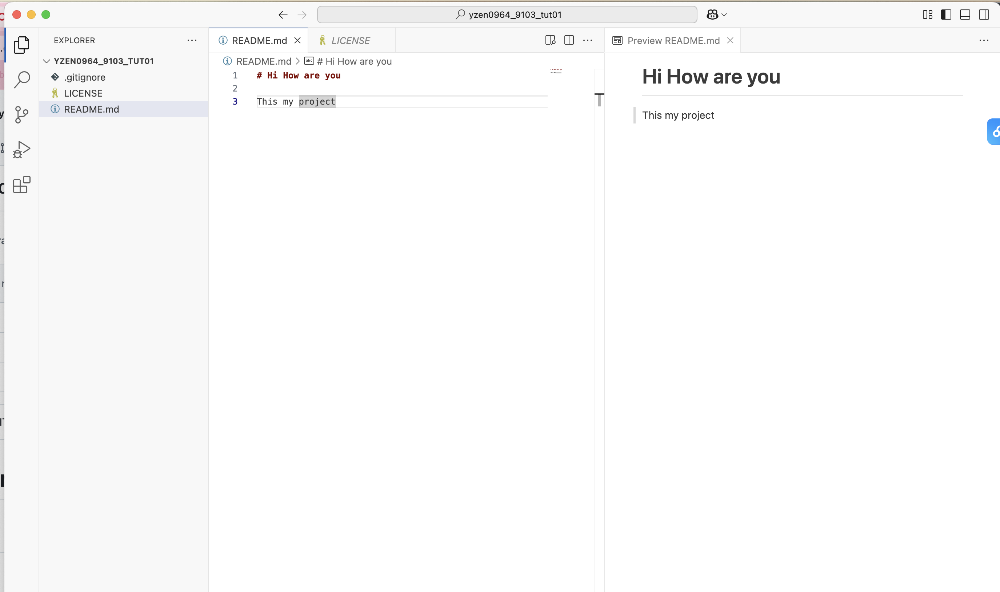

# Quiz 8

#### My art project aims to explore dreamy and surreal visual aesthetics 4

# Imaging Technique Inspiration 1

This artwork uses programming to reconstruct eight ancient artifacts, showing how broken relics come to life through the ripples of time from a digital art perspective. The fragmented particle effect is very inspiring, and I hope to apply this reconstruction technique in my final project.
[Artwork Reference Link1](https://www.bilibili.com/video/BV1DC4y1d7gd/?spm_id_from=333.337.search-card.all.click&vd_source=a1518caac7875e4722f1d25a07010a11)
 


This project explores the theme of electronic lichen. Its flowing, fragmented particle effect really attracts me, and I’d like to experiment with this technique in my future work.
[Artwork Reference Link2](https://www.bilibili.com/video/BV1mM411U7cn/?spm_id_from=333.788.recommend_more_video.17&vd_source=a1518caac7875e4722f1d25a07010a11)

[Artwork Reference Link3](https://www.bilibili.com/video/BV1CA41197fX/?spm_id_from=333.788.recommend_more_video.-1&vd_source=a1518caac7875e4722f1d25a07010a11)


I was inspired by the project’s layered visuals and floating mix of ruins and nature. I want to use its fragmented, immersive style to create a surreal space that blurs reality and imagination.

[Artwork Reference Link4](https://cifra.com/project/3e372bdb-86de-47ee-84d5-a8790141450b)


# Coding Technique Exploration 1

Pixel Swapper can help me create this kind of particle effect. This code uses the get() and set() functions in p5.js to randomly swap pixels in an image. By repeating this process, it creates a flowing, glitchy distortion effect that helps me achieve a dreamy and surreal visual style.
[Coding technique1](https://happycoding.io/tutorials/p5js/images/pixel-swapperv)


Random Walker can help me achieve the visual effect I want. I can set a specific color range and let the code change colors within that range.
[Coding technique2](https://happycoding.io/tutorials/p5js/animation/random-walker)


This code creates a parallax effect by moving dots at different speeds based on the mouse position, helping me build a layered, dynamic, and immersive visual scene.
[Coding technique3](https://happycoding.io/tutorials/p5js/creating-classes/parallax-dots)


[Link Text](https://www.google.com)


##### Header 5
###### Header 6


**Bold Text** or __Bold Text__

*Italic Text* or _Italic Text_


- Item 1
- Item 2
  - Subitem 2.1
  - Subitem 2.2 dsfjisojfoso


1. First Item
2. Second Item
3. Third Item

[Link Text](https://www.google.com)


I use [Google](https://www.google.com.hk/webhp?hl=zh-CN&sourceid=cnhp&gws_rd=ssl) to search for my result




```
function helloWorld() {
console.log("Hello, world!");
}
```

> This is a blockquote.


